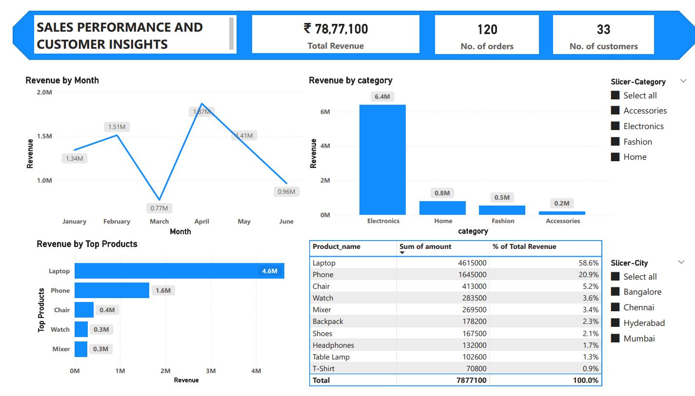

# Sales Project 2 – Customer & Product Analytics Dashboard
# Project Overview

This project focuses on advanced sales analytics using SQL and Power BI.
The dashboard analyzes:

- Customer segmentation
- Best-selling products
- Category growth trends
- Repeat purchase behavior
- Pareto analysis (80/20 revenue rule)

# Tools Used
- SQL
- Power BI
- Excel
- GitHub

# SQL Business Problems Solved

## 1️. Customer Segmentation
Classified customers into:
- High Value
- Medium Value
- Low Value
using revenue-based NTILE segmentation.

## 2️. Best Selling Products
Identified:
- Highest revenue generating products
- Most ordered products
using aggregation and ranking functions.

## 3️. Product Category Growth Rate
Calculated:
- Month-over-Month category growth
- Fastest growing category
using:
- LAG()
- Window functions
- Growth percentage calculation

## 4️. Repeat Purchase Analysis
Identified customers who repeatedly purchased the same products.
Used:
- GROUP BY
- HAVING
- Customer purchase frequency analysis

## 5️. Pareto Analysis (80/20 Rule)
Found products contributing to 80% of total company revenue.
Used:
- Running cumulative revenue
- Window SUM()
- Percentage contribution analysis
---

# Key Insights
- Electronics category contributed highest revenue
- Laptop generated nearly 58% of total revenue
- April recorded peak monthly sales
- Few products contributed majority of business revenue

# Dashboard Preview

# Files Included
- `Sales Project 2.pdf`
- SQL query files
- Dashboard screenshot
- README documentation

# Skills Demonstrated
- SQL Window Functions
- CTEs
- Ranking Functions
- Business Analytics
- Power BI Dashboarding
- Data Visualization
- Revenue Analysis
- Customer Analytics
